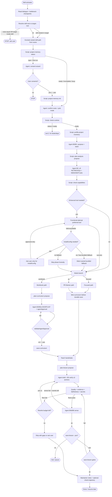
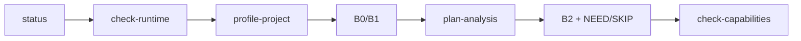
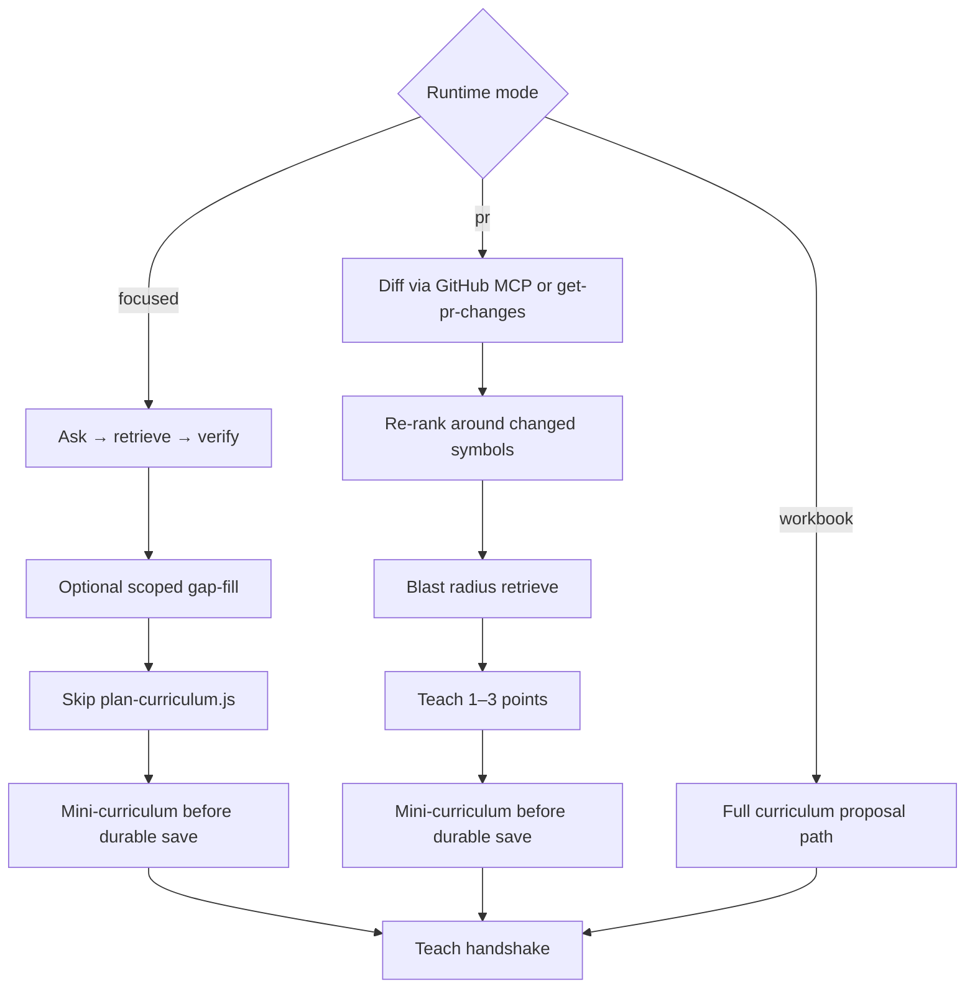
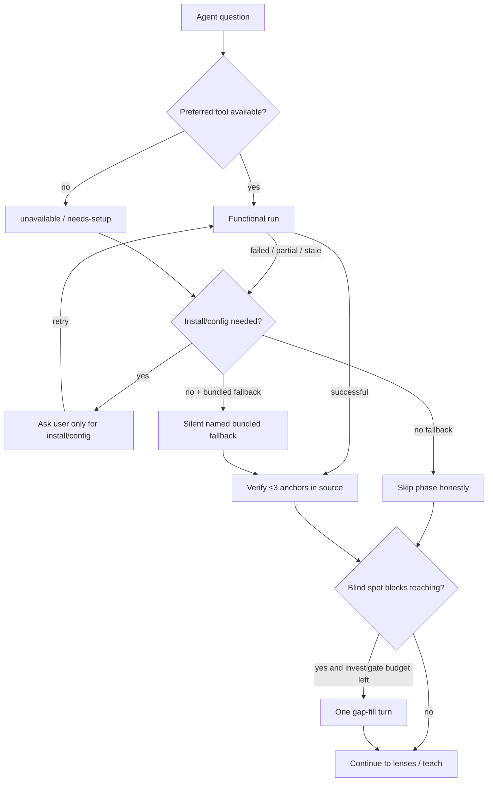
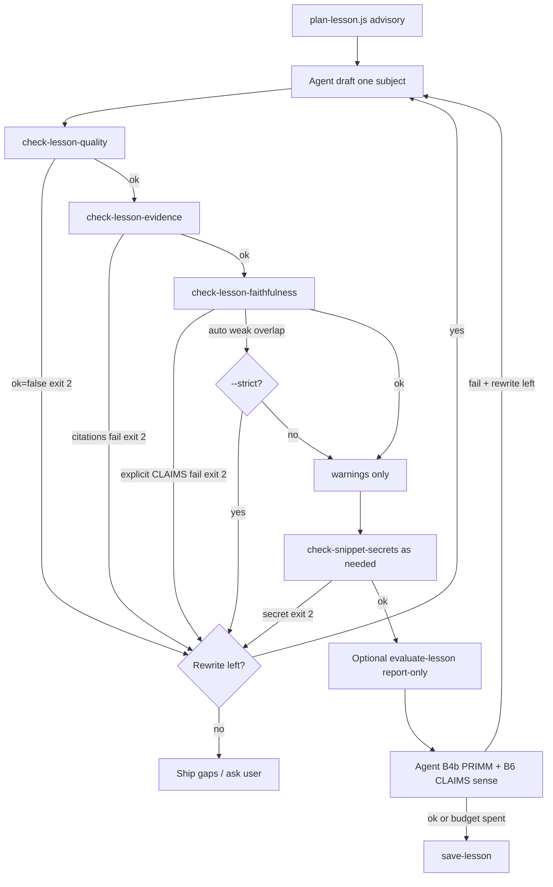
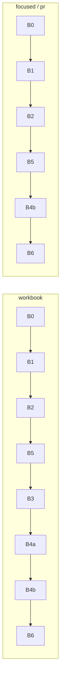

# How repay-techdebt works

End-to-end control flow for the skill: who decides, which scripts run, and every meaningful
condition branch. Agent policy lives in markdown (`SKILL.md` + references). Only predicates in
`scripts/**` and `src/**` are mechanically enforced (import-graph + `node --check`).

## High-level path

1. **Resolve the target.** Skill install and analyzed app stay separate. In-repo skill paths are
   excluded from every scan.
2. **Load preferences safely.** First-run wizard can create private memory, project-local memory,
   team memory, or nothing.
3. **Take turns.** Bundled scripts inventory, gate, and propose (`nextAsks`). The agent confirms
   purpose, retrieves with Graphify/Serena when available, verifies live source, and teaches.
4. **Rank the investigation.** Questions are prioritized by request, focus, program type, graph
   evidence, and impact, not a universal checklist. Script plans are proposals, not finished truth.
5. **Approve the book index.** Whole-app runs propose a broad subject inventory. The agent
   shortlists before save, then writes 1–3 lessons per run.
6. **Use stronger tools when they matter.** Prefer available optional tools silently. On miss use
   the named bundled fallback with the same UX. Ask only for install/config. See [tools.md](tools.md).
7. **Qualify and teach.** Mechanical lesson QA plus one agent semantic pass. Cite paths and lines.
   end with honest gaps. Tool outcomes stay in maintainer notes, not learner chat.

Maintenance flags, viewer, and CLI: [manual.md](manual.md). Evidence model and modes:
[concepts.md](concepts.md).

---

## Overview flowchart



---

## Partners and turn shape

| Partner     | Owns                                                                                                               | Must not own                                                                       |
| ----------- | ------------------------------------------------------------------------------------------------------------------ | ---------------------------------------------------------------------------------- |
| **Scripts** | Consent/runtime/capability gates. Inventories. Wrappers. Coverage math. Proposal JSON. Mechanical QA. Atomic saves | Final “what to teach”. Unverified absence claims. Lesson taste                     |
| **Agent**   | Purpose. Retrieve questions. Live-source verify. Shortlist. Draft. Semantic qualify. Maintainer tool notes         | Skipping consent/secrets/capability prompts. Dressing model prior as observed fact |

Every major script return is a **proposal**, not finished truth:

| Field            | Meaning                                                       |
| ---------------- | ------------------------------------------------------------- |
| `role`           | `gate` \| `inventory` \| `retrieve` \| `propose` \| `check`   |
| `blindSpots[]`   | Known unknowns                                                |
| `mustNotClaim[]` | Forbidden claims given current coverage                       |
| `nextAsks[]`     | `{ who, do, why?, when?, question? }` - agent must TAKE these |

**Turn shape:** `ASK → RUN → RETURN → TAKE`

**Caps (agent policy):** ≤1 extra investigate turn per phase. ≤1 lesson rewrite. Then ship with gaps or ask the user.

**Skip rules:** inventory / propose / retrieve may skip only with a ledger reason when stronger evidence already exists. Never skip consent, secrets, or capability-failure prompts.

---

## 1. Activation and roots

### Entry

1. Agent loads `SKILL.md`.
2. Immediately reads `references/agent-machine-contract.md` (invokes, formats, exits, install),
   then `references/script-agent-dialogue.md` and `references/bottleneck-checkpoints.md`.
3. Sets `<skill-root>` = directory containing this `SKILL.md`.
4. Sets `<target-root>` = application repo (usually the workspace active before entering the skill).

### Root branches

| Condition                                       | Branch                                                      |
| ----------------------------------------------- | ----------------------------------------------------------- |
| Target missing / not a directory / unresolvable | Script throw `TargetRootError` → typically **exit 1**       |
| `targetRoot` is same as or inside `skillRoot`   | Code `TARGET_IS_SKILL` → **STOP**, ask user                 |
| Skill nested inside target                      | Continue, but every scan must exclude the nested skill path |
| Roots OK and distinct                           | Continue                                                    |

Preserve-project invariants (always on):

- Analysis-only unless user separately requests implementation.
- Default **zero writes** into the application repo.
- Memory/config/tool artifacts → private user storage. Workbook → sister directory `repay-<project>-techdebt` by default.
- `.repay-techdebt/` inside target only after explicit project-local/team choice.
- Never install analyzers into the target dependency environment.
- Never expose secrets. Never create image files / HTML `` (Markdown / Mermaid / tables only).

---

## 2. Shared head (all modes)



### 2.1 Memory status

```text
node <skill-root>/scripts/project-memory.js status <target-root> --format json
```

| Status / condition                                  | Branch                                                                                  |
| --------------------------------------------------- | --------------------------------------------------------------------------------------- |
| `type: "first-run"` (no ready store)                | Run consent wizard (`templates/introduction-wizard.md`, `references/project-memory.md`) |
| Competing private + project-local stores both ready | Must pass `--storage private\|project-local\|team` or throw                             |
| Only private ready/exists                           | Mode `private`                                                                          |
| Only local ready/exists                             | Mode `project-local`                                                                    |
| Env `REPAY_TECHDEBT_STATE_DIR` / `_CACHE_DIR`       | Override storage bases                                                                  |
| Recoverable lesson-index drift                      | Rebuild derived links silently, rerun status once, continue the lesson request          |
| Incomplete memory / locked / storage conflict       | Ask only when recovery could overwrite or change ownership                              |

### 2.2 Init consent (first-run)

First-run paths (see `templates/introduction-wizard.md`):

| Path        | User reply         | Init defaults                                                                                   |
| ----------- | ------------------ | ----------------------------------------------------------------------------------------------- |
| **Fast**    | `fast` (`express`) | private memory, sister workbook, `--mode workbook`, depth `balanced`, `--save-policy automatic` |
| **Control** | `control`          | Full option tables. Defaults often mode `ask`, save-policy `ask` unless chosen                  |

| Condition                                        | Branch                              |
| ------------------------------------------------ | ----------------------------------- |
| Mutation without `--yes`                         | Emit `consent-required`, **exit 2** |
| User declines                                    | STOP                                |
| Team storage + non-git without `--allow-non-git` | Refuse, **exit 2**                  |
| Root already exists / competing store            | Refuse, **exit 2**                  |
| `--yes` after consent                            | `project-memory.js init …`          |

Stored preference `choices.mode`: `ask` \| `pr` \| `workbook` (not `focused`).  
`ask` means: each session, ask the user which runtime mode to use.

### 2.3 Runtime gate

```text
node <skill-root>/scripts/check-runtime.js --format json
```

| Condition             | Branch                                       |
| --------------------- | -------------------------------------------- |
| Node / deps not ready | **exit 2** - fix environment before analysis |
| Ready                 | Continue                                     |

### 2.4 Inventory → B0 / B1

```text
node <skill-root>/scripts/profile-project.js <target-root> [--scope <path>] --format json
```

**Agent B0 - Purpose**

| Reply                               | Effect                                                                              |
| ----------------------------------- | ----------------------------------------------------------------------------------- |
| `ACCEPT purpose`                    | Purpose has a concrete anchor (README/docs/user). Later `purposeStatus: "accepted"` |
| `UNRESOLVED purpose + ≤3 questions` | Do not invent users/SLOs/workflows. Later `purposeStatus: "unresolved"`             |

**Agent B1 - Stack**

Confirm or correct `primaryArchetype`, `languages[]`, `frameworks[]`. Flag pack mismatches. Ledger records corrections.

### 2.5 Analysis propose → B2

```text
node <skill-root>/scripts/plan-analysis.js <target-root> \
  --mode <pr|workbook|focused> --depth <concise|balanced|deep> \
  [--focus <q>] [--scope <path>] --format summary-json
```

Agent turns use this script + `summary-json` (or full `json`). Do not use human CLI `repay plan`
for machine parsing - TTY pretty table drops `nextAsks` / `toolChain`. Piped `repay plan` falls
back to `summary-json`. Script path remains the contract.

| Condition                             | Branch                                                                                                                    |
| ------------------------------------- | ------------------------------------------------------------------------------------------------------------------------- |
| `--mode focused` and no `--focus`     | Throw → **exit 1**                                                                                                        |
| Mode omitted                          | Defaults to `workbook`                                                                                                    |
| Depth `concise` / `balanced` / `deep` | Caps lenses/packs (4/8, 8/20, 12/40)                                                                                      |
| Coverage partial/truncated/scoped     | Envelope adds `mustNotClaim: complete-call-graph, whole-application-absence` and nextAsk `accept-partial-scope-or-narrow` |
| Purpose-like unresolved in profile    | nextAsk `confirm-purpose`                                                                                                 |
| Mode workbook                         | nextAsk `approve-curriculum-shortlist` (later)                                                                            |
| Mode focused \| pr                    | nextAsk `pick-retrieve-questions`                                                                                         |

**Agent B2:** emit ≤5 specific retrieve questions. Mark each `toolChain` step `needed` \| `not-needed`.

### 2.6 Capabilities gate

```text
node <skill-root>/scripts/check-capabilities.js <target-root> --format json
```

| Condition                            | Branch                                                                                    |
| ------------------------------------ | ----------------------------------------------------------------------------------------- |
| Tool `ready`                         | May attempt functionally                                                                  |
| `missing` / `needs-setup` / `broken` | Do **not** claim it ran. Use named bundled fallback silently. Ask only for install/config |
| Checker itself throws                | **exit 1**                                                                                |
| Missing tools alone                  | Does **not** exit 2 - report only                                                         |

Bundled profiler success ≠ Graphify / Serena / Semgrep / Context7 success. See [tools.md](tools.md).

---

## 3. Mode branches



### 3.1 Focused

1. Agent phrases the question.
2. Prefer Graphify / Serena when available (ask only before install/extract).
3. On miss: silent bundled fallback - `query-program-model.js` / scoped scans.
4. Verify 2–3 anchors in live source (B5).
5. Optional gap-fill:
   - `find-patterns.js --scope <path>` OK
   - whole-repo `find-patterns.js` only with explicit `--all`
   - neither flag → **exit 1**
   - both flags → **exit 1**
   - zero files in scope → tool-failure **exit 2**
6. Skip `plan-curriculum.js` (full workbook inventory).
7. Before durable save: mini-curriculum (`buildTeachingCurriculum` → `save-curriculum`) so lessons link from `INDEX.md`.
8. Enter teach handshake.

### 3.2 PR Mentor

1. Gather diff: GitHub MCP **or** `get-pr-changes.js` (exclude `.repay-techdebt/`).
2. Re-rank around changed symbols and likely consumers.
3. Retrieve/verify blast radius.
4. `plan-analysis.js --mode pr`.
5. Pick **1–3** teaching points (not every hunk).
6. Skip full `plan-curriculum.js` unless the user asks for a whole-app workbook from the PR.
7. Before durable save: mini-curriculum (`buildTeachingCurriculum` → `save-curriculum`) so every lesson links from `INDEX.md` - same workbook shape as whole-app mode.
8. Teach handshake.

### 3.3 Whole-app workbook

See §4. Then loop 1–3 lessons per run. Resume from `INDEX.md`.

---

## 4. Workbook curriculum path (fine-grained)

```mermaid
flowchart TD
  A[plan-curriculum.js] --> B[Bounded batch + alternates + signalClass + nextAsks]
  B --> C[Agent SHORTLIST keep/demote/fold/add + rewrite]
  C --> D[Stamp agentApproval]
  D --> E{validateAgentApproval}
  E -->|no agentApproval| E1[Fail: proposal only]
  E -->|bad purposeStatus| E2[Fail: must be accepted\|unresolved]
  E -->|partial ∧ ¬acceptedPartialScope| E3[Fail: accept partial scope]
  E -->|omnibus topic remains| E4[Fail: split/demote]
  E -->|naming-heuristic uncorroborated| E5[Fail: corroborate or demote]
  E -->|ok| F{--yes?}
  F -->|no| F1[consent-required exit 2]
  F -->|yes| G{validateCurriculum extras}
  G -->|minimal count / decisions / IDs fail| G1[Throw exit 1]
  G -->|compression / chapters / placeholders| G2[Save with visible warnings]
  G2 --> H
  G -->|ok| H{Secretlint}
  H -->|fail| H1[secret-risk exit 2]
  H -->|ok| I[Write curriculum.json + INDEX.md]
```

### 4.1 Proposal (`plan-curriculum.js`)

Topics get `signalClass`:

| Predicate                                             | `signalClass`      |
| ----------------------------------------------------- | ------------------ |
| Workflow + critical-workflow / project-config reasons | `user`             |
| Dependency with relations **or** `relationCount >= 2` | `ast`              |
| Otherwise                                             | `naming-heuristic` |

Extra nextAsks always include corroborate naming-heuristic + Graphify hubs.  
If any topic matches omnibus regex → nextAsk `split-or-demote-omnibus-topics`.

Batch-only proposals keep exactly N `topics`, diversify them by mechanism/domain family, and expose
up to nine ranked `proposal.alternates`. Alternates are decision support, not saved curriculum.
`summary-json` omits raw parser diagnostics. Full JSON/catalog output is an explicit diagnostics path.

Omnibus regex (title/focus/learnerOutcome): phrases like “whole app”, “entire codebase”, “complete overview”, “everything about”, etc. (`src/curriculum/curriculum-policy.js`).

### 4.2 `agentApproval` shape

```json
{
  "approvedAt": "<ISO>",
  "purposeStatus": "accepted | unresolved",
  "corroboratedTopicIds": ["topic-…"],
  "demotedTopicIds": [],
  "topicDecisions": {
    "topic-…": { "action": "demote | fold", "intoTopicId": "topic-…", "reason": "…" }
  },
  "placeholderReasons": {},
  "addedTopicIds": [],
  "acceptedPartialScope": null | true | "<reason>",
  "note": null
}
```

`--yes` alone is **not** approval.

### 4.3 Approval predicates (`validateAgentApproval`)

Checked in order. First failure wins:

1. `agentApproval` object present.
2. `approvedAt` non-empty string.
3. `purposeStatus ∈ {accepted, unresolved}`.
4. If coverage is partial (`truncated === true` OR `status ∈ {partial, scoped-analysis}`) → require `acceptedPartialScope`.
5. Decision IDs/actions/targets are valid. Demotions/folds carry reasons. Fold evidence joins the kept target.
6. After decisions and legacy `demotedTopicIds`: no omnibus topics.
7. Every remaining `naming-heuristic` topic (default if `signalClass` missing) must be in `corroboratedTopicIds` **or** `topic.corroborated === true`.

### 4.4 Save curriculum extras (`validateCurriculum`)

| Condition                                                | Branch             |
| -------------------------------------------------------- | ------------------ |
| `schemaVersion !== 1` or no `topics[]`                   | Throw              |
| `target.root` ≠ requested target                         | Throw              |
| Topic IDs not unique `topic-[a-f0-9]{12}`                | Throw              |
| Missing title/focus/learnerOutcome/chapter/evidencePaths | Throw              |
| Duplicate focuses                                        | Throw              |
| Kept topics &lt; max(1, min(3, availableCandidates))     | Throw              |
| Topics &gt; 150                                          | Throw              |
| &gt;40 topics, &gt;80% keep/collapse, or narrow chapters | Save with warnings |
| Unchanged planner title/outcome without reason           | Save with warnings |

Raw candidates are inventory, not a curriculum-size requirement. The agent owns the shortlist.
scripts require deliberate decision records and surface extreme compression/retention for review.

Partial coverage after save: forbids whole-app **absence** claims unless `acceptedPartialScope` was set.

---

## 5. Coverage and dialogue envelope branches

Program model (`program-intelligence.js` facade. Coverage in `program-coverage.js`, discovery in
`program-scan.js`):

| Condition                               | `coverage.status` / flags |
| --------------------------------------- | ------------------------- |
| `truncated` OR any `reasonCodes`        | `partial`                 |
| else                                    | `complete`                |
| Scope ≠ `"."`                           | reason `scoped-analysis`  |
| File/manifest/relation/byte budgets hit | truncated + reason codes  |

Envelope (`dialogue-envelope.js`) when partial:

- blindSpot: `unmodeled-files-beyond-budget-or-scope`
- mustNotClaim: `complete-call-graph`, `whole-application-absence`
- nextAsk: `accept-partial-scope-or-narrow`

---

## 6. Retrieve / tool failure branches



Analyzer outcome vocabulary: `successful` \| `failed` \| `unavailable` \| `unconfigured` \| `partial` \| `stale` \| `refused`.

| Phase             | Prefer             | Bundled fallback (silent. Ask only install/config)       | Hard fail without fallback                                  |
| ----------------- | ------------------ | -------------------------------------------------------- | ----------------------------------------------------------- |
| Architecture      | Graphify           | `query-program-model.js` / scoped `scan-architecture.js` | Graphify extract/query fail → exit 2. Extract needs `--yes` |
| Symbols           | Serena             | Bundled AST + source verify                              | -                                                           |
| Security          | Semgrep            | Secretlint + manual                                      | Semgrep fail without `--fallback secretlint` → exit 2       |
| Architecture scan | dependency-cruiser | `--fallback tree`                                        | Without fallback → exit 2                                   |
| PR/CI             | GitHub MCP         | `get-pr-changes.js`                                      | -                                                           |
| Docs              | Context7           | Official primary docs                                    | -                                                           |
| Large/remote      | Repomix stdout     | Scoped outline                                           | -                                                           |
| Patterns          | -                  | `find-patterns --scope` or `--all`                       | Leads only (`notExhaustive: true`). Not workbook driver     |

Runtime evidence collection is permission-gated: without `--consent` → `refused` (CLI typically exit 1). After consent, command failure → exit 2.

---

## 7. Teach handshake (fine-grained)



### 7.1 Quality floor (`inspectLesson`)

Errors (any → `ok: false` → check CLI **exit 2**):

| Predicate                                                                                        | Fail                                             |
| ------------------------------------------------------------------------------------------------ | ------------------------------------------------ |
| Word count outside depth band                                                                    | concise 250–650. Balanced 450–950. Deep 700–1300 |
| `##` section count ∉ 3–8                                                                         | Fail                                             |
| Empty/generic headings (Predict/Run/Investigate/Modify/Make/Overview/…)                          | Fail                                             |
| &lt; 2 distinct cited source paths                                                               | Fail                                             |
| Topic `expectedEvidencePaths` set and no cite matches                                            | Fail                                             |
| AI puffery phrases                                                                               | Fail                                             |
| Generic lesson-announcement opening                                                              | Fail                                             |
| Malformed Quick check choices or missing explanatory feedback                                    | Fail                                             |
| Think first prompt without an answer                                                             | Fail                                             |
| Curriculum lesson missing explicit learning-moment decisions                                     | Fail at durable save                             |
| Included learning-moment decision without its matching block, or vague include/omit reason       | Fail at durable save                             |
| Mermaid: forbidden types / missing accTitle\|accDescr / &gt;30 lines / missing “What this shows” | Fail                                             |
| External image/diagram sidecars                                                                  | Fail                                             |

Warnings (do not alone fail quality): long or path-heavy paragraphs, sections over 350 words,
source code excerpts over 40 lines, repeated lesson announcements, missing “you/your”, missing
causal or verification language, or a horizontal (`LR`/`RL`) flowchart that should use a compact
portrait layout. See for yourself walkthroughs also warn when they omit ordered DevTools steps, a
safe execution context and Change one thing variation, the observable signal to Look for, or an
explicit Reset. Instructions to expose secrets, mutate production, or bypass a protection fail.
lessons with more than three interactive moments are prompted to keep only the useful pauses.
The planner separately records Quick check, Think first, and See for yourself as recommended,
candidate, or omitted opportunities. Draft inspection warns when a strong misconception or safe
browser-observation opportunity is silently skipped. Curriculum save requires a specific include or
omit decision for all three and rejects plan-to-draft inconsistency.

### 7.2 Citation validity (`verifyLessonCitations`)

One shared citation model feeds extraction, validity, faithfulness windows, search, viewer notes,
and editor links. It accepts `path:line` and `path:start-end`. En/em dashes in ranges normalize to an
ASCII hyphen. Every range must repeat its project-relative path.

For each citation:

| Condition                                 | Problem |
| ----------------------------------------- | ------- |
| Not `path:line` or `path:start-end` shape | Fail    |
| Backticked range has no path              | Fail    |
| Resolves outside target                   | Fail    |
| Not a file / missing                      | Fail    |
| Line &gt; file line count                 | Fail    |

### 7.3 Claim faithfulness

| Mode                 | When                            | Save-lesson                                                                         | CLI default                     |
| -------------------- | ------------------------------- | ----------------------------------------------------------------------------------- | ------------------------------- |
| `explicit-claims`    | `CLAIMS:` block parses ≥1 claim | **Blocks** if `support:yes` but snippet overlap &lt; 0.35 (default) or cite missing | Always exit 2 on those problems |
| `auto-near-citation` | No CLAIMS block                 | Problems → **warnings only**                                                        | Exit 2 only with `--strict`     |

CLAIMS line format:

```text
CLAIMS:
1. "<claim>" - <path:line> - support: yes|no|gap - state: observed|derived|inferred|hypothesis
```

### 7.4 Secrets

| Check                                                           | Fail branch                               |
| --------------------------------------------------------------- | ----------------------------------------- |
| Snippet not inside target, or inside skill / `.repay-techdebt/` | exit 1 (`SNIPPET_NOT_APPLICATION_SOURCE`) |
| Secretlint finds secret                                         | exit 2                                    |
| save-lesson/curriculum Secretlint fail                          | `secret-risk`, exit 2                     |

### 7.5 `evaluate-lesson.js` (optional)

Runs `runTeachFloors` (quality + citations + faithfulness + pedagogy) plus deterministic rubric
proxies. **Exit 2 only if quality/citation floors fail.** Faithfulness/rubric are report-only here
(save still has its own faithfulness gate for explicit CLAIMS via `evaluateLessonForSave`).

### 7.6 `save-lesson` branches

| Condition                                       | Branch                                    |
| ----------------------------------------------- | ----------------------------------------- |
| No `--yes`                                      | `consent-required`, exit 2                |
| Curriculum has topics and no `--topic-id`       | Throw (topic required to link INDEX)      |
| `--topic-id` unknown                            | Throw                                     |
| Quality / citation / explicit faithfulness fail | `lesson-quality-failed`, exit 2           |
| Secretlint fail                                 | `secret-risk`, exit 2                     |
| Lock / write conflict                           | Conflict / busy handling, exit 1–2        |
| No curriculum / no `--topic-id` after write     | `workbook-linkage-required`, exit 2       |
| All OK                                          | Write lesson. Update topic status + INDEX |

`savePolicy` (`ask` \| `automatic`) is **stored preference for the agent**. The script always requires `--yes`. The agent decides whether to ask the user before passing it.

---

## 8. Checkpoint trajectory (B0–B6)



| Checkpoint           | Ask (agent)                                 | Floor (script)                | Sense                            |
| -------------------- | ------------------------------------------- | ----------------------------- | -------------------------------- |
| **B0** Purpose       | ACCEPT \| UNRESOLVED                        | `purposeStatus` on approval   | Concrete anchor or unresolved    |
| **B1** Stack         | Confirm/correct languages/frameworks        | Packs ⊆ registry              | Corrections in ledger            |
| **B2** Inventory     | ≤5 retrieve questions from blindSpots       | Envelope fields present       | Questions tool-ready             |
| **B5** Relations     | Who calls / calls what / registered / fails | Anchors verified. Gaps named  | ≤3 anchors verified or gap named |
| **B3** Subjects      | SHORTLIST + corroborate heuristics          | `agentApproval` gate          | Shortlist ≠ scanner top-N        |
| **B4a** Curriculum   | Order + split omnibus                       | Topic floors + omnibus reject | One outcome per topic            |
| **B4b** Lesson craft | PRIMM without empty headings                | `check-lesson-quality`        | Semantic checklist               |
| **B6** Evidence      | CLAIMS decomposition                        | evidence + faithfulness       | Claim↔snippet support            |

`check-trajectory.js` / `validateTrajectory`:

| Condition                               | Branch         |
| --------------------------------------- | -------------- |
| Step id ∉ B0–B6                         | Error          |
| status ∉ {done, skipped}                | Error          |
| skipped without `reason`                | Error          |
| done without `reply`                    | Error          |
| Required IDs not in order (subsequence) | Error          |
| Workbook missing B3 or B4a step object  | Error          |
| Validation fail                         | CLI **exit 2** |

Conformance (`run-conformance.js`) also validates a workbook trajectory stub after memory init.

---

## 9. Exit code convention

| Code  | Meaning                                                                                                                          |
| ----- | -------------------------------------------------------------------------------------------------------------------------------- |
| **0** | Success (or help / stub printed)                                                                                                 |
| **1** | Usage / target / unexpected throw                                                                                                |
| **2** | Expected control-flow gate: consent, quality/evidence/faithfulness fail, hard tool-failure, incomplete memory, runtime not ready |

---

## 10. Source reliability ranking

When stating facts, prefer higher ranks. Never dress a lower rank as a higher one:

1. Current target source / config / lockfile / tests
2. Successful enhanced tool ops after functional check
3. Version-matched authoritative docs
4. User confirmation of purpose/criticality
5. Deterministic script **derived** facts (+ limitations)
6. Script **inferred** heuristics (paths, pattern catalog, folders)
7. Model prior (**hypothesis** only)

Evidence language: `references/evidence-contract.md`.

---

## 11. Script catalog by role

Role sample only - not full inventory. Full list: `scripts/*.js`. Agent chains and failure UX:
[tools.md](tools.md), `references/tool-integrations.md`.

| Role          | Scripts                                                                                                                                                                                     |
| ------------- | ------------------------------------------------------------------------------------------------------------------------------------------------------------------------------------------- |
| **gate**      | `project-memory.js`, `check-runtime.js`, `check-capabilities.js`                                                                                                                            |
| **inventory** | `profile-project.js`, `build-program-model.js`                                                                                                                                              |
| **retrieve**  | `run-graphify.js`, `get-pr-changes.js`, `query-program-model.js`, `scan-*`, `find-patterns.js` (leads only)                                                                                 |
| **propose**   | `plan-analysis.js`, `plan-curriculum.js`, `plan-lesson.js`                                                                                                                                  |
| **check**     | `check-lesson-quality.js`, `check-lesson-evidence.js`, `check-lesson-faithfulness.js`, `check-snippet-secrets.js`, `check-trajectory.js`, `evaluate-lesson.js` (report), `review-lesson.js` |

Also present (ops / deeper retrieve): `plan-runtime-evidence.js`, `collect-runtime-evidence.js`,
`render-system-atlas.js`, `refresh-curriculum.js`, `repay-cli.js`, `repay-mcp.js`,
`evaluate-skill.js`, `run-conformance.js`, `validate-release.js`, …

---

## 12. Key implementation files

| Path                                      | Owns                                                         |
| ----------------------------------------- | ------------------------------------------------------------ |
| `SKILL.md`                                | Activation, shared head, mode pointers, teach handshake      |
| `references/agent-machine-contract.md`    | Exact invokes, formats, exit→action, install, anti-improvise |
| `references/script-agent-dialogue.md`     | Turn map, caps, mode paths, semantic checklist               |
| `references/bottleneck-checkpoints.md`    | B0–B6 cards + CLAIMS format                                  |
| `references/analysis-protocol.md`         | Phases 1–8 execution detail                                  |
| `references/tool-integrations.md`         | Tool statuses, failure prompt, chains                        |
| `references/project-memory.md`            | Storage modes, wizard, privacy                               |
| `src/foundations/targeting.js`            | Root resolution refusals                                     |
| `src/foundations/private-storage.js`      | Private vs project-local locate                              |
| `src/foundations/memory-paths.js`         | `resolveMemoryPaths` / memory layout (CLI must not own this) |
| `src/dialogue/dialogue-envelope.js`       | Envelope + `topicSignalClass`                                |
| `src/program/program-model-schema.js`     | Zod schemas + `MODEL_VERSION`                                |
| `src/program/program-scan.js`             | File discovery / classify helpers                            |
| `src/program/program-coverage.js`         | Pure coverage aggregation                                    |
| `src/program/plan-analysis-core.js`       | `planAnalysis` + `summarizeModel`                            |
| `src/program/program-intelligence.js`     | Facade: `buildProgramModel` + re-exports                     |
| `src/curriculum/curriculum-planning.js`   | Curriculum proposal                                          |
| `src/curriculum/curriculum-approval.js`   | Approval / corroboration / partial-scope gates               |
| `src/curriculum/curriculum-policy.js`     | Omnibus topic detection                                      |
| `src/curriculum/approve-curriculum.js`    | `validateCurriculum` (approval + structural floors)          |
| `src/curriculum/mini-curriculum.js`       | `buildTeachingCurriculum` for PR/focused mini workbooks      |
| `src/lessons/claim-faithfulness.js`       | CLAIMS parse + snippet overlap                               |
| `src/lessons/lesson-citation-check.js`    | Citation validity + shared extract                           |
| `src/lessons/lesson-quality.js`           | Mechanical lesson QA                                         |
| `src/lessons/save-lesson.js`              | `evaluateLessonForSave` + `runTeachFloors`                   |
| `src/tools/analyzer-result.js`            | Shared analyzer result factory (no base-class port)          |
| `src/dialogue/trajectory.js`              | Mode trajectories                                            |
| `src/memory/curriculum-store.js`          | Read/write curriculum JSON                                   |
| `src/memory/curriculum-refresh.js`        | Evidence digests + curriculum refresh                        |
| `src/memory/learning-progress.js`         | Exercise records + review scheduling                         |
| `src/evaluation/evaluation.js`            | Fixture curriculum evaluation runner                         |
| `src/evaluation/evaluation-schema.js`     | Fixture + expectation Zod schemas                            |
| `src/packs/pack-registry.js`              | Pack catalog load + detect                                   |
| `scripts/project-memory.js`               | status/init/save-curriculum/save-lesson CLI                  |
| `src/viewer/*`, `scripts/view-lessons.js` | Local workbook browser (markdown-it, progress.json)          |

---

## 13. Agent-only vs script-enforced

| Rule                                       | Enforced by                       |
| ------------------------------------------ | --------------------------------- |
| Read dialogue/checkpoints at activation    | Agent                             |
| ≤1 investigate / ≤1 rewrite caps           | Agent                             |
| Silent bundled fallback. Ask only install  | Agent                             |
| Honor `savePolicy=ask` before `--yes`      | Agent                             |
| Mini-curriculum before PR/focused save     | Agent (script links via topic-id) |
| Pick focused vs workbook from user intent  | Agent                             |
| `agentApproval` fields                     | Script on `save-curriculum`       |
| Citation / quality / explicit faithfulness | Script on checks + `save-lesson`  |
| find-patterns `--scope`/`--all`            | Script                            |
| Target≠skill                               | Script                            |
| Consent `--yes` on mutations               | Script                            |

If a branch matters for safety (consent, secrets, citations, approval), it is script-enforced. The agent owns teaching quality beyond deterministic floors and may still ship with named gaps after the rewrite budget is spent.
