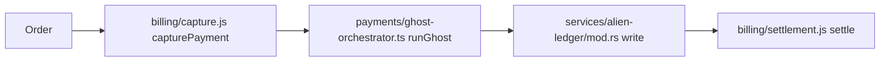

# Fake graph that invents modules

When money moves, **imaginary services appear on the map**. After this lesson you can spot diagram nodes that are not real files.

## Why this path exists

Capture should hand work to settle. A bad diagram invents extra modules so the map lies about ownership.

## Map the two roles



**What this shows:** two nodes are not in this repository inventory.

## Walk the path in code

Start at `billing/capture.js:1`. The real handoff does not include ghost modules.

```js
// billing/capture.js:1
export function capturePayment() {
  return 1;
}
```

Then open `billing/settlement.js:1` for the status stamp only — not alien ledgers.

## The pitfall people miss

Treating every diagram box as a real file. Invented paths make debugging open the wrong tree.

## Check yourself

Open `billing/capture.js` and name one diagram node above that is **not** a real path in this repo.

**If you remember one thing:** every map node path must exist in the inventory.
