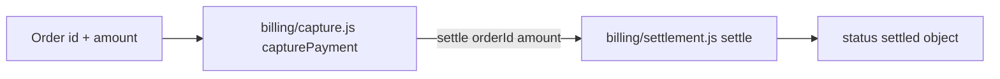

# How capture hands money work to settle

When money moves in this billing slice, **one function validates the order and another records settlement**. If you only read `capturePayment`, you will miss where status becomes `"settled"`. After this lesson you can open two real files and point at the exact handoff.

## Why this path exists

Capture is the public entry for an order that already has an id and amount. Settlement is the helper that turns those values into a settled result. The split means you can change settlement policy without rewriting every caller that still needs the same order check.

That boundary is the whole lesson. You are not learning a full payments platform — only this path through _these_ files. When a bug report says “capture returned settled but the id was wrong,” you already know which file validated the order and which file stamped status — so you open the right one first.

## Map the two roles



**What this shows:** validation lives only in capture; settlement status is produced only in settle. Follow the arrow when you debug a missing `"settled"` field.

## Walk the path in code

Start at `billing/capture.js:4`. `capturePayment` takes an `order`. Before any settlement call, it rejects a missing id:

```js
// billing/capture.js:5
if (!order?.id) throw new Error("order required");
```

Only after that guard does it return the result of `settle` in `billing/capture.js:6`:

```js
// billing/capture.js:6
return settle(order.id, order.amount);
```

Cross into `billing/settlement.js:2`. `settle` does not re-check the order object. It accepts `orderId` and `amount`, then returns a plain object with `status: "settled"` at `billing/settlement.js:3`.

So the ordered path is: **order in → id required → settle(orderId, amount) → settled object out**. Capture never writes the status string itself.

## The pitfall people miss

A common wrong mental model: “capture owns the whole payment, including status.” That reading fails as soon as you ask where `"settled"` is assigned. It is only in settle. Another trap: treating settle as optional decoration. Capture’s return value _is_ settle’s return value, so a change to settle’s shape changes every capture caller.

What goes wrong if you skip the id guard and call settle with garbage? Settle still returns a settled-shaped object with whatever id you passed — so capture’s guard is the only gate that keeps incomplete orders out of settlement.

## Check yourself

Open `billing/capture.js` and `billing/settlement.js`. Without scrolling the lesson:

1. Point at the line where capture refuses to proceed without an order id.
2. Point at the line where status becomes `"settled"`.
3. Say in one sentence who owns validation vs who owns settlement status.

Private answer: (1) `billing/capture.js:5`, (2) `billing/settlement.js:3`, (3) capture validates; settle records status.

**If you remember one thing:** money status is not set in capture — capture only validates, then hands off to settle.
